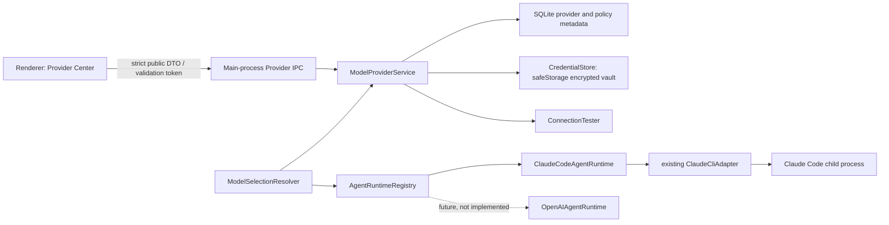

# Model Provider Center Design

> Date: 2026-08-09  
> Status: approved for implementation  
> Scope: Claude Workbench v1.0 RC,方案 A（Claude Code remains the only implemented Agent Runtime）

## 1. Outcome and non-goals

Model Provider Center manages providers, credentials, discovered/manual models, defaults, Agent role policies, and task overrides without replacing `ClaudeCliAdapter` or weakening existing Task, Permission, Session, MCP, Git, Checkpoint, or Workflow boundaries.

This phase does **not** implement an OpenAI-compatible to Anthropic protocol gateway and does **not** implement `OpenAIAgentRuntime`. A pure OpenAI-compatible provider can be created, tested, and queried for models, but cannot be selected for a Claude Code task or Agent Workflow. The UI must show the exact warning:

> 当前 Provider 不支持 Claude Code Agent Runtime

## 2. Architectural boundaries



Trust decisions are made only in the main process. Renderer values are selection intent, not trusted provider identity, capability, credential reference, runtime type, or process environment.

## 3. Public domain model

```ts
type ModelProviderType =
  | 'anthropic'
  | 'anthropic-compatible'
  | 'openai-compatible'
  | 'custom';

type ModelApiFormat = 'anthropic-messages' | 'openai-chat-completions';
type AgentRuntimeType = 'claude-code' | 'none' | 'openai-agent';
type ProviderHealthState = 'not_configured' | 'configured' | 'connected' | 'error';
type PolicyRating = 'low' | 'medium' | 'high';

interface ProviderCapabilities {
  supportsClaudeCode: boolean;
  supportsAgentWorkflow: boolean;
  supportsTools: boolean;
  supportsMCP: boolean;
  supportsStreaming: boolean;
  supportsVision: boolean;
}

interface ProviderModelRef {
  providerId: string;
  modelId: string;
}

interface ProviderHealth {
  state: ProviderHealthState;
  lastTestedAt: number | null;
  lastErrorType:
    | 'invalid_key'
    | 'forbidden'
    | 'not_found'
    | 'rate_limited'
    | 'timeout'
    | 'network'
    | 'invalid_response'
    | 'unknown'
    | null;
  latencyMs: number | null;
}

interface AgentModelPolicyNotes {
  quality: PolicyRating | null;
  speed: PolicyRating | null;
  cost: PolicyRating | null;
}

interface PublicModelProvider {
  id: string;
  name: string;
  type: ModelProviderType;
  apiFormat: ModelApiFormat;
  runtimeType: AgentRuntimeType;
  baseUrl: string | null;
  enabled: boolean;
  isDefault: boolean;
  configured: boolean;
  credentialSource: 'credential_store' | 'environment' | 'claude_code' | 'none';
  capabilities: ProviderCapabilities;
  supportedUses: Array<'chat' | 'agent_task' | 'claude_code' | 'mcp_tools' | 'vision'>;
  health: ProviderHealth;
  defaultModelId: string | null;
  createdAt: number;
  updatedAt: number;
}
```

The public DTO never contains a secret, encrypted blob, vault path, `credential_ref`, request header, or complete connection error body.

## 4. Capability rules

Capabilities are persisted as six checked boolean columns so lists and policies can be queried without parsing JSON. They are not arbitrary trust claims. `ProviderCapabilityResolver` computes a maximum capability envelope from the registered runtime and provider/API type. User configuration may narrow optional capabilities, but cannot elevate `supportsClaudeCode` or `supportsAgentWorkflow` beyond the runtime registry.

| Provider/API | Runtime | Claude Code | Agent Workflow | Tools | MCP | Streaming | Vision |
| --- | --- | ---: | ---: | ---: | ---: | ---: | ---: |
| Anthropic / Anthropic Messages | `claude-code` | true | true | true | true | true | true by default |
| Anthropic-compatible / Anthropic Messages | `claude-code` | true | true | true by default | true | true | false by default |
| OpenAI-compatible / Chat Completions | `none` | false | false | declared/discovered only | false | true by default | false by default |
| Custom / Anthropic Messages | `claude-code` after successful validation | true | true | conservative defaults | true | true | false by default |
| Custom / OpenAI Chat Completions | `none` | false | false | declared/discovered only | false | declared | declared |

`runtimeType='openai-agent'` is reserved in types and the registry interface but rejected as unavailable until a real runtime is registered. OpenAI-compatible providers are never passed to `ClaudeCliAdapter` in this phase.

The Renderer derives the user-facing supported-use labels from the trusted public capability DTO; it never guesses from Provider names. Under the only currently implemented runtime, the mapping is:

- `普通聊天`: a runnable `claude-code` Provider (`supportsClaudeCode=true`);
- `Agent任务`: `supportsAgentWorkflow=true`;
- `Claude Code`: `supportsClaudeCode=true`;
- `MCP工具`: `supportsMCP=true`;
- `视觉任务`: `supportsVision=true`.

This deliberately does not label a raw OpenAI-compatible Provider as supporting ordinary application chat merely because its connection probe succeeds. Connection management and runtime execution are separate capabilities.

Every main-process selection must check:

- provider exists, is enabled, and has a usable credential source;
- requested model belongs to that provider or is a validated manual model;
- runtime exists and matches `runtimeType`;
- task requires `supportsClaudeCode=true`;
- Workflow roles additionally require `supportsAgentWorkflow=true`;
- tool-using Coder/Tester/Fixer stages require `supportsTools=true` and `supportsMCP=true`;
- an unsupported selection fails before TaskManager starts a run or creates a child process.

## 5. Runtime abstraction

```ts
interface AgentRuntime {
  readonly type: AgentRuntimeType;
  readonly implemented: boolean;
  supports(provider: PublicModelProvider): boolean;
  runPrompt(options: ClaudeRunOptions): Promise<ClaudeRunDescriptor>;
  stopRun(runId: string): Promise<boolean>;
  subscribe(listener: (event: ClaudeEventEnvelope) => void): () => void;
}

interface AgentRuntimeRegistry {
  get(type: AgentRuntimeType): AgentRuntime | null;
  assertRunnable(provider: PublicModelProvider, use: 'task' | 'workflow'): void;
}
```

`ClaudeCodeAgentRuntime` is a thin registration wrapper around the existing `ClaudeCliAdapter`; it does not replace its spawning, permission, event, or process supervision behavior. No `OpenAIAgentRuntime` class is added now. The interface and `openai-agent` discriminator are the only forward-compatible reservation.

For an application-configured Claude runtime provider, `ClaudeCliAdapter` receives a trusted `providerId` and resolves a per-child environment patch through a main-process dependency. It never receives `credential_ref`. The resolver removes inherited `ANTHROPIC_API_KEY`, `ANTHROPIC_AUTH_TOKEN`, and `ANTHROPIC_BASE_URL` before inserting the selected provider values so concurrent tasks cannot mix providers. It never mutates global `process.env`.

## 6. Existing environment compatibility

When no task, project, role, or global application Provider wins, resolution falls through to the current Claude Code/environment behavior unchanged.

- `ANTHROPIC_API_KEY`, `ANTHROPIC_AUTH_TOKEN`, and `ANTHROPIC_BASE_URL` remain valid.
- Existing Claude Code login/configuration remains valid.
- MiMo through an Anthropic-compatible gateway remains runnable by Claude Code.
- A DeepSeek OpenAI-compatible record is manageable and testable but is not runnable by Claude Code unless the user separately points Claude Code at an Anthropic-compatible gateway and represents that gateway as an Anthropic-compatible Provider.
- Environment and Claude Code sources appear as read-only synthetic Providers; their public state contains booleans and sanitized origin information, never environment values.

## 7. CredentialStore

The default backend is Electron `safeStorage` in the main process. Encrypted bytes are stored under `userData/model-credentials/<opaque-uuid>.bin`; SQLite stores only `safe-storage://v1/<opaque-uuid>`. References reject absolute paths, traversal, alternate schemes, symlinks, and missing/oversized blobs.

On Windows, `safeStorage` uses the OS encryption facility. If encryption is unavailable, saving fails closed. Linux `basic_text` or unknown backends are rejected; there is no plaintext fallback.

Credential entry uses a password field only for the initial create/update submission. The secret may exist transiently in that trusted form's memory because a user must type it, but it is immediately transferred to the main process, cleared on settlement/unmount, never returned, and never placed in a global store, browser storage, database, logs, diagnostics, crash metadata, URL, or CLI arguments. Subsequent Renderer DTOs expose only `configured` and `credentialSource`.

After save, the credential is replace-only: there is no reveal, prefill, copy, or decrypt-to-Renderer path. Replacing it requires a fresh password-field entry and successful connection validation. Provider deletion presents an explicit confirmation that the associated stored credential will also be deleted; cancellation leaves both records untouched.

Credential lifecycle uses compensation because SQLite and the filesystem cannot share one transaction:

- create/update: encrypt and atomically write a new blob, commit the new reference in SQLite, then delete the old blob; DB failure deletes the new blob;
- delete: mark the provider disabled and enqueue a cleanup tombstone transactionally, delete the blob idempotently, then delete dependent metadata and the tombstone;
- startup retries pending tombstones and removes only verified orphan vault files;
- a Provider referenced by a running task cannot be updated or deleted until the task finishes;
- changing a Provider origin requires a fresh connection test and explicit credential re-entry, preventing silent credential forwarding to another origin.

## 8. Connection validation and model discovery

Provider creation is a two-step main-process transaction:

1. `validateDraft(inputWithSecret)` performs a real network request and retains the immutable tested draft plus secret in an in-memory, single-use, five-minute token. It returns only a public result, discovered model IDs, and the validation token.
2. `createProvider(validationToken)` consumes that token, writes the encrypted credential, then commits provider/model metadata. A failed or expired validation cannot be saved.

Saved Provider testing decrypts only for the duration of the main-process request.

- Anthropic formats send a minimal `POST /v1/messages` request with bounded output.
- OpenAI-compatible formats attempt bounded `GET /models`; if unsupported and a manual model is supplied, they perform a minimal `POST /chat/completions` request.
- Requests use a fixed timeout, one bounded retry only for retryable transport/5xx/429 failures, `redirect: 'manual'`, bounded response bytes, and no automatic cross-origin credential forwarding.
- Public error categories are `invalid_key`, `forbidden`, `not_found`, `rate_limited`, `timeout`, `network`, `invalid_response`, and `unknown` with HTTP status and a safe message.
- Raw headers, request bodies, response bodies, URLs containing credentials/query secrets, and HTTP client objects are never logged or returned.

Manual model IDs and discovered models are stored separately; the application does not hardcode a catalog.

## 9. SQLite schema v6

Migration v6 is one outer transaction followed by existing foreign-key and integrity checks. It adds:

- `model_providers`: identity, type, API format, runtime type, sanitized base URL, opaque `credential_ref`, default model, enabled/default flags, six capability booleans, metadata JSON, timestamps;
- `model_providers` also persists sanitized health facts: `health_state`, `last_tested_at`, `last_error_type`, and `latency_ms`; it never persists raw error bodies;
- `model_provider_models`: `(provider_id, model_id)` primary key, display name, `manual|discovered` source, timestamps;
- `agent_model_policy`: Agent type to provider/model, supporting Planner/Coder/Tester/Reviewer/Fixer, plus optional `quality`, `speed`, and `cost` notes constrained to `low|medium|high`;
- `project_model_policy`: project-scoped default and per-role provider/model selection, required by the stated project-over-global precedence;
- `task_model_overrides`: task primary key to provider/model with cascade deletion;
- `credential_cleanup_jobs`: opaque cleanup reference and retry metadata, never secret material.

Foreign keys prevent policy/model references crossing Providers. A partial unique index allows at most one enabled global default. Capability columns have `0/1` checks, runtime/API combinations have consistency checks, metadata must be valid JSON, and `credential_ref` must be null or use the safe-storage scheme. Migration tests cover fresh install, v5 upgrade, rollback, future-version rejection, integrity, constraints, and restart persistence.

## 10. Model resolution and lifecycle

For each normal task or Workflow stage, `ModelSelectionResolver` resolves a concrete immutable `ResolvedModelSelection` in this order:

1. task model override;
2. project role policy, then project default;
3. global Agent role policy;
4. global default Provider/model;
5. inherited environment Provider;
6. Claude Code default.

The main process persists the resolved provider/model/runtime/source snapshot on the task/run and on each Workflow stage. Public source labels are fixed as `任务覆盖`, `项目策略`, `全局默认`, `环境变量`, and `Claude Code`; the internal enum remains stable and language-neutral. A running stage does not change when settings are edited. A change while an idle Task already exists applies only to subsequent calls and displays “模型改变只影响后续 Agent 调用。” Active `starting/running/waiting_permission` tasks cannot switch.

Workflow creation snapshots the current policy. Planner/Coder/Tester/Reviewer/Fixer resolution preserves current fallback behavior (Tester/Fixer fall back to Coder when no explicit role entry), but every resolved Provider must pass capability validation before stage spawn. Resume across a different Provider/runtime starts a new Claude session rather than reusing an incompatible Claude session ID.

## 11. Renderer and IPC

Settings gains a dedicated “模型与连接” area with:

- paginated Provider list and connected/disabled/unsupported state;
- Provider type, API format, Runtime type, exact capability chips, supported task types, sanitized Base URL, credential status/source, default model, and model list;
- user-friendly supported-use chips for `普通聊天`, `Agent任务`, `Claude Code`, `MCP工具`, and `视觉任务`, derived from the main-process capability result;
- health state (`已配置`, `连接成功`, or safe error state), most recent test time, categorized recent error, and measured latency;
- add/edit wizard with type, name, URL, transient credential, manual model, real test, discovered models, and save only after success;
- exact unsupported-runtime warning and disabled Agent selection controls;
- test, refresh models, set default, edit, disable, and delete actions;
- Agent Model Policy editor for Planner/Coder/Tester/Reviewer/Fixer, including informational `quality`, `speed`, and `cost` ratings that never trigger automatic routing;
- project policy editor using the same provider/model selector;
- no secret reveal or copy action.

The top toolbar shows `Provider / Model`, opens a quick switcher with Provider, Runtime, capabilities, and the effective source (`任务覆盖`, `项目策略`, `全局默认`, or `环境变量`), and disables switching during active work. An idle switch requires the “only future calls” acknowledgement. The task composer can create a task-only override without modifying global settings.

Provider IPC uses strict Zod schemas, input size limits, pagination, main-frame sender validation, and explicit confirmation for destructive deletion. Preload exposes named methods only. The existing generic settings IPC is tightened to a known-key allowlist and rejects secret-shaped keys; it is not used for Provider credentials.

## 12. Security invariants

- API credentials are never returned to Renderer, persisted in Renderer, logged, exported, or placed in ordinary SQLite fields.
- Diagnostics use the existing fixed-file allowlist and recursive redaction, add Provider-specific sentinel tests, and exclude the entire credential vault.
- No log call receives a decrypted secret, authenticated request object, raw HTTP error, or response body.
- Provider base URLs allow HTTPS and explicit loopback HTTP for development, reject embedded credentials, query/fragment secrets, non-HTTP schemes, cloud metadata targets, and credential-bearing redirects.
- Capability flags and runtime compatibility are re-derived in main on every save and selection.
- OpenAI-compatible selections fail before TaskManager/Workflow creates a run; tests assert `ClaudeCliAdapter.runPrompt` was never called.
- Provider-specific environment patches are constructed per child process and never mutate or persist global environment values.
- PermissionBroker, MCP configuration, TaskManager leases, Agent Workflow state, and Session identity remain unchanged.

## 13. Testing and production acceptance

The implementation target is at least 240 new/expanded tests matching the requested matrix: Provider CRUD 30, Credential 30, Connection 40, Migration 20, Agent Policy 30, Task Override 20, Security 30, UI 40. Tests are written red-first and include real temporary SQLite databases, temporary encrypted vault files with injected safeStorage doubles, bounded local HTTP servers, IPC identity checks, and Renderer projections that cannot contain secret/ref/blob fields.

Production Electron acceptance will verify:

- Provider Center navigation, add/test/save, discovered/manual models, default selection, policy assignment, task override, top toolbar display, restart persistence, and deletion cleanup;
- a sentinel credential never appears in visible UI after submission, application logs, SQLite text fields, diagnostics ZIP, task events, or process arguments;
- Anthropic/Anthropic-compatible selections invoke the existing Claude runtime with the correct per-process model/environment binding;
- MiMo remains compatible when represented by an Anthropic-compatible gateway;
- OpenAI-compatible DeepSeek is manageable/testable, visibly unsupported for Claude Code, blocked from Workflow selectors, and never launches `ClaudeCliAdapter`;
- Planner/Coder/Reviewer stage records contain the resolved provider/model/source and only runnable selections execute;
- restart retains Provider metadata, encrypted credential availability, policies, and model cache.

All existing tests remain, followed by `typecheck`, `lint`, full tests, production build, security-focused tests, and production Electron acceptance.

## 14. Deliberate limitations

- No embedded protocol translation gateway.
- No direct OpenAI Agent runtime in this phase.
- OpenAI-compatible tool/vision declarations are informational until a runtime implements and validates them; they do not make the Provider Workflow-selectable.
- `safeStorage` protects credentials at rest against other OS users, not arbitrary code already running as the same compromised user.
- A fully native OS password-entry dialog is not included; initial entry is transient in the trusted Renderer form, while stored credentials are never exposed back to Renderer.
