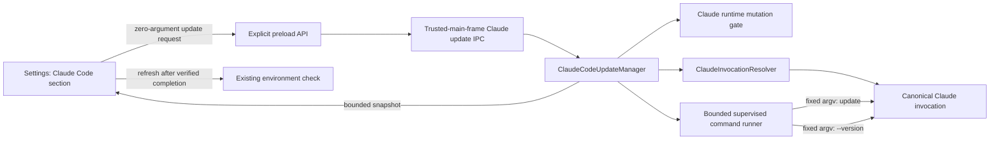

# Manual Claude Code Update Design

> Date: 2026-08-21
> Status: approved for implementation; close-owned process amendment recorded 2026-08-21
> Scope: Claude Workbench desktop settings, manual Claude Code CLI update only

## 1. Outcome

Claude Workbench adds one explicit **立即更新** action to the existing Claude Code section in Settings. Nothing runs automatically. A user click asks the main process to update the same Claude Code installation selected by the application's authoritative command resolver, using Claude Code's own fixed command:

```text
claude update
```

After the command completes, the main process resolves the installation again, verifies that it is still the same installation target, reads its version again, and returns a bounded public result. The Settings view then refreshes its existing environment information so the displayed Claude Code version is current.

This feature is a host-tool mutation, so all authority remains in the main process. The Renderer cannot choose an executable, path, package manager, command, argument, version, URL, or environment variable.

## 2. Goals

- Provide a visible, user-initiated **立即更新** button beside the existing Claude Code installation information.
- Update the exact Claude Code installation that Workbench uses for real tasks, not an arbitrary same-named binary.
- Use Claude Code's supported self-update command rather than reimplementing npm, WinGet, download, or installer behavior.
- Refuse to update while a Claude task is active, and refuse new Claude tasks while an update is running.
- Keep update execution single-flight, bounded, cancellable during application shutdown, and free of raw error or credential disclosure.
- Verify the installation identity and version after the command before reporting success.
- Test all mutation behavior with injected local fakes and synthetic fixtures. Tests never update the developer machine's real Claude Code installation and never require network access.

## 3. Non-goals

This slice does **not**:

- check for or install updates at startup, on a timer, when Settings opens, or in the background;
- add an automatic-update setting, an automatic-check setting, a scheduler, or a notification poller;
- install Claude Code when it is missing;
- invoke `npm install`, `npm update`, `winget upgrade`, PowerShell package commands, a browser download, or any other fallback installer;
- update an unknown, ambiguous, renderer-supplied, or custom free-text path;
- change the Workbench application updater in `src/main/release`;
- change Task2C2, release preflight, trusted Windows runner, release contracts, toolchain policy, reviewed-input hashes, packaging, or release evidence;
- add dependencies or change `package.json`, `package-lock.json`, Vitest, Vite, TypeScript, or ESLint configuration;
- make the currently persisted `claudePath` or `autoDetectClaude` values authoritative. They remain display/configuration data until a separate custom-path design defines their trust and validation rules;
- claim that an exit code alone proves a successful update.

## 4. User experience

The existing Claude Code section in Settings continues to show installation status, path summary, version, and installation type. It gains a compact update row:

- **立即更新** is enabled only when Claude Code is available and no update is running.
- Clicking the button is the explicit mutation authorization; no background action occurs before the click.
- While running, the button is disabled and shows a busy label such as **正在更新…**.
- If a Claude task is active, no child process is started and the UI shows a localized blocked message.
- If a local version/help/diagnostics probe is still closing, the update is not queued or retried; the UI shows a localized temporary-busy message and the user may click again later.
- If Claude Code is unavailable, the button is disabled and the existing installation guidance remains visible.
- A successful version change shows the previous and current versions.
- A successful command with the same verified version reports **已是最新版本**.
- Unsupported self-update, permission denial, timeout, identity drift, invalid version output, or other failure shows a bounded localized message. Raw stdout, stderr, executable paths, environment values, and exception text are never rendered.
- After `updated` or `up_to_date`, Settings refreshes the existing environment check exactly once.

Opening Settings, navigating to the section, reading state, or refreshing the environment must not invoke `claude update`.

## 5. Architecture



### 5.1 `ClaudeInvocationResolver`

The private resolver currently embedded in `src/main/ipc/system.ts` moves to a main-only Claude domain module, tentatively:

```text
src/main/claude/ClaudeInvocationResolver.ts
```

It returns a frozen invocation owned by the main process:

```ts
interface ResolvedClaudeInvocation {
  executable: string;
  prefixArgs: readonly string[];
  environmentPatch: Readonly<Record<string, string>>;
  displayPath: string;
  canonicalTargetPath: string;
  provenance: 'native' | 'npm';
}
```

Resolver rules:

- preserve operating-system command resolution order. Inspect the first locator result, canonicalize it, and either accept that exact candidate as a supported native/npm invocation or fail closed; never skip it to prefer a later extension class;
- collapse repeated locator lines only when they canonicalize to the same target under platform path semantics. Distinct later installations remain ignored rather than forming an implicit allowlist;
- use the existing fixed native/npm fallback locations only when the operating-system locator returns no candidate at all, in their documented fixed order;
- reject the selected candidate if canonical case, ordinary-file type, package boundary, or stable realpath cannot be proven. A case-fold collision, changing reparse target, or one locator candidate resolving to conflicting canonical identities is `ambiguous`; an ordinary second installation later in PATH is not;
- accept only an ordinary, canonical local target supported by the existing resolver;
- map an npm shim to its real `@anthropic-ai/claude-code/cli.js` and run that file through the existing Electron-as-Node invocation;
- do not execute `.cmd` through a shell;
- do not trust renderer settings, caller-supplied paths, repository-local executables, or a selected alias whose canonical target cannot be proved;
- return no public raw path from the update API;
- represent installation identity as canonical target path plus provenance and fixed invocation prefix, not as a mutable binary hash or inode.

`environmentPatch` contains only resolver-required invocation mode values, such as `ELECTRON_RUN_AS_NODE=1`; it is not a copy of `process.env`. Its sorted key/value pairs are part of the captured invocation identity. `ClaudeCliAdapter` merges task-specific provider environment separately. The update runner never receives provider credentials and removes inherited `ANTHROPIC_API_KEY`, `ANTHROPIC_AUTH_TOKEN`, `ANTHROPIC_BASE_URL`, and Workbench permission tokens before spawning.

The existing system environment checks, the real `ClaudeCliAdapter`, and the update manager all receive the same resolver instance. `ClaudeCliAdapter.checkInstallation()` and `ClaudeCliAdapter.runPrompt()` resolve immediately before spawning, capture one immutable invocation for that child, prepend its resolver-owned `prefixArgs`, and merge only its resolver-owned environment patch. Production no longer launches a bare `claude` command independently of the resolver.

This unification is required for correctness: if environment detection, task execution, and updating can choose different PATH entries, Workbench cannot prove which installation it changed. Existing adapter tests may inject a synthetic resolver, but the production constructor cannot fall back to a second resolution algorithm. This slice does not otherwise redesign environment diagnostics or make persisted custom-path settings authoritative.

When the explicit `FORCE_FAKE` acceptance mode selects `FakeClaudeAdapter`, the update manager is unavailable and an update request performs zero resolution and zero process execution. A deterministic fake task runtime must never authorize mutation of a real host installation.

### 5.2 `ClaudeCodeUpdateManager`

A new main-only manager owns update state and execution:

```text
src/main/claude/ClaudeCodeUpdateManager.ts
```

Its public methods are conceptually:

```ts
getSnapshot(): ClaudeCodeUpdateSnapshot;
updateNow(): Promise<ClaudeCodeUpdateSnapshot>;
isUpdating(): boolean;
dispose(): Promise<void>;
```

`updateNow()` acquires the update gate synchronously before its first asynchronous boundary. Concurrent calls share the same in-flight promise and cannot start a second child process.

The manager receives dependencies for resolution, version probing, bounded command execution, active-task inspection, runtime-mode inspection, and public logging. Unit tests replace those dependencies with local fakes.

### 5.3 Runtime mutation gate

A small main-only `ClaudeRuntimeMutationGate` coordinates every production-reachable child process that can execute or inspect Claude Code. It provides two lease classes:

- an ordinary shared lease for installation, version, help, diagnostics, and real task invocations;
- one exclusive update lease used only by `ClaudeCodeUpdateManager`.

An ordinary caller synchronously acquires its lease before any asynchronous boundary, resolver call, locator child, or Claude child, and holds it until every owned child has emitted `close` and cleanup is confirmed. An update lease can be acquired only when the ordinary lease count is zero and no update lease exists. While the update lease is held, new ordinary leases fail immediately. Therefore a probe that started first blocks the update, and an update that started first blocks the probe; neither relies on a check-then-spawn boolean.

Updating the CLI and running a Claude task are mutually exclusive:

1. `updateNow()` synchronously checks the ordinary lease count and authoritative active-task collection, then atomically acquires the exclusive update lease before resolving or spawning.
2. `src/main/index.ts` registers a before-run listener through the existing `TaskManager.subscribeBeforeRuns()` API. The listener rejects a new Claude run while the gate is acquired; `TaskManager` does not import or own the updater.
3. If a task becomes active first, the update request returns `blocked` without resolving or spawning the update command.
4. If the update acquires the gate first, later task starts are rejected until the update reaches a terminal state.
5. Every terminal and exceptional path releases its lease exactly once, after child close and cleanup confirmation.

This double-sided check closes the check-then-spawn race without stopping an existing task or silently queueing user work.

While an update lease is active, system/version/help diagnostics and `ClaudeCliAdapter.checkInstallation()` fail to acquire an ordinary lease and return their existing bounded busy/unavailable result without invoking the locator or starting a Claude child. The update manager's own locator, pre-version, update, and post-version children are the only invocations authorized by its lease. The Settings update flow does not refresh environment information until the manager reaches a terminal state, then performs exactly one fresh ordinary-lease probe.

`src/main/security/EnvironmentChecker.ts` contains a legacy direct `claude --version` implementation but has no production import at this baseline. This feature does not reuse it. A dependency-boundary regression test proves it remains unreachable from `src/main/index.ts` and the registered IPC/task composition. If implementation discovers a production reference, work stops for a design amendment rather than leaving a gate bypass.

`src/main/index.ts` owns the listener and IPC disposers. During shutdown it first stops accepting new update IPC requests, then asks the manager to terminate and await any owned update child while the before-run guard remains installed. It unregisters the guard only after the update lease is released. This order prevents shutdown from reopening a task/update race.

### 5.4 Bounded command execution

Production execution uses the existing supervised-process boundary or a narrowly extracted wrapper around it. It must preserve these invariants:

- `shell: false`;
- ignored stdin;
- exact executable and resolver-owned prefix arguments;
- the only mutating suffix is exactly `['update']`;
- version probes use exactly `['--version']`;
- no renderer-supplied arguments or environment values;
- a fixed timeout appropriate for a CLI self-update;
- independent hard caps on stdout and stderr;
- one-settlement semantics based on child `close`, not an early stream event;
- timeout and application shutdown terminate the owned process tree and wait for cleanup confirmation;
- unresolved cleanup is an error, never success;
- raw output is retained only transiently in the main process and is neither logged nor returned.

The current `ProcessSupervisor` settles on a child `error` event before `close`. This feature therefore adds an opt-in close-only settlement mode to that existing supervisor. Its default mode and all existing consumers remain unchanged. In close-only mode, `error` is recorded but ownership stays active until `close`; missing-PID and launch-journal failure paths also kill and await bounded close confirmation before returning. The update runner alone enables this mode, then layers stdout/stderr caps and its update timeout over the owned handle. This avoids a second process-tree implementation while preserving existing task and terminal behavior.

If a close-only launch cannot confirm `close` within that bounded launch-cleanup window, the supervisor throws a typed cleanup-unconfirmed error that retains an opaque, idempotent cleanup capability. The capability owns no public path or command data and can only retry the already-owned child's termination/close confirmation; it cannot spawn or target an arbitrary PID. The update runner retains this capability, rejects the transaction as `cleanup_unconfirmed`, and invokes it again from `dispose()`. A confirmed retry clears the retained capability and permits the manager to release its exclusive runtime lease. An unconfirmed retry remains fail-closed and makes shutdown unclean. This ownership transfer is required for both missing-PID and start-journal failure paths so `spawn()` never loses the only object capable of proving final close.

After `spawn()` has returned a normal close-only `ManagedProcessHandle`, the update runner likewise retains that handle until `close`. If timeout, output overflow, or shutdown calls `terminate()` and close cannot be confirmed, the runner keeps the same handle as pending cleanup and retries `terminate()` from `dispose()`. A later close or successful retry clears it; another unconfirmed result keeps the runtime gate latched and shutdown unclean. Thus both pre-handle and post-handle cleanup failures retain one retryable owner.

The update command may use the network internally because that is Claude Code's own documented behavior, but Workbench neither constructs a download URL nor directly communicates with an update service.

## 6. State and public contract

The Renderer receives a frozen, bounded DTO:

```ts
type ClaudeCodeUpdateStatus =
  | 'idle'
  | 'blocked'
  | 'updating'
  | 'updated'
  | 'up_to_date'
  | 'unavailable'
  | 'error';

type ClaudeCodeUpdateReason =
  | 'active_tasks'
  | 'runtime_busy'
  | 'not_installed'
  | 'unsupported_installation'
  | 'identity_changed'
  | 'invalid_version'
  | 'permission_denied'
  | 'timed_out'
  | 'cleanup_unconfirmed'
  | 'update_failed'
  | null;

interface ClaudeCodeUpdateSnapshot {
  status: ClaudeCodeUpdateStatus;
  reason: ClaudeCodeUpdateReason;
  beforeVersion: string | null;
  afterVersion: string | null;
}
```

The snapshot deliberately omits:

- executable and installation paths;
- argv and environment details;
- stdout and stderr;
- exit codes and operating-system errors;
- package-manager identity;
- URLs, credentials, tokens, and raw exception messages.

The manager stores no persistent update preference. A new application launch with the real adapter starts in `idle` and does not perform a probe or update. When `FORCE_FAKE` selects the deterministic adapter, the initial snapshot and every `getSnapshot()` call are `unavailable/unsupported_installation`; the Renderer disables the button, and neither operation invokes the resolver or creates a process.

## 7. Exact update transaction

One click executes this transaction:

1. Reject with `unavailable/unsupported_installation` before touching the gate when the deterministic fake runtime is selected.
2. In one synchronous, no-`await` section, check the authoritative active-task collection and conditionally acquire the exclusive update lease. Active tasks return `blocked/active_tasks`; a nonzero ordinary lease count returns `blocked/runtime_busy`. Neither failure acquires a lease, queues work, retries, resolves an invocation, or creates a process.
3. Resolve the authoritative invocation and capture its canonical installation identity.
4. Run the fixed `--version` probe and parse a bounded supported semantic version.
5. Run the exact resolver-owned invocation plus `update`.
6. Require exit success, bounded output, confirmed child close, and confirmed process-tree cleanup.
7. Resolve Claude Code again.
8. Require the same canonical target path, provenance, executable route, prefix arguments, and resolver-owned environment patch. Replacement of bytes at that same target is allowed and expected; redirecting resolution to another installation is not.
9. Run `--version` on the post-update invocation.
10. Require a valid version that is not lower than the pre-update version.
11. Return `updated` when the version increased, or `up_to_date` when it is unchanged.
12. Release the acquired exclusive lease exactly once only after child close and cleanup are confirmed. If cleanup is unconfirmed, return `error/cleanup_unconfirmed` but retain the exclusive lease and disable further updates and Claude tasks for the rest of the session; `dispose()` makes one final supervised cleanup attempt and releases the lease only if that attempt is confirmed. A failed final cleanup makes shutdown unclean rather than reopening execution.

An exit-zero update followed by missing, malformed, lower, or differently resolved Claude Code is `error`, not success.

## 8. IPC and preload boundary

A dedicated registrar, tentatively `src/main/ipc/claude-updates.ts`, follows the existing trusted release-IPC pattern:

- `CLAUDE_CODE_UPDATE_GET_STATE`
- `CLAUDE_CODE_UPDATE_NOW`

Both requests accept an exact empty tuple. The trusted-main-frame check runs before argument parsing and manager access. The handler returns only `ClaudeCodeUpdateSnapshot`.

The preload exposes named Promise methods:

```ts
getClaudeCodeUpdateState(): Promise<ClaudeCodeUpdateSnapshot>;
updateClaudeCodeNow(): Promise<ClaudeCodeUpdateSnapshot>;
```

No generic invoke channel, subscription, progress stream, path argument, confirmation token, or command argument is added. The button click itself is the explicit authorization.

The exhaustive public API manifest, preload transport tests, and typecheck fixtures must be updated together so an accidental extra method or argument fails closed.

## 9. Error and privacy behavior

- Known internal failures map to the fixed reason codes above.
- Unknown failures map to `error/update_failed`.
- Public logs may record a fixed stage and reason code, but never raw child output, paths, inherited environment values, authorization headers, tokens, or arbitrary exception text.
- Renderer messages come from localized reason-code mappings, not main-process strings.
- A permission or organization-policy failure does not trigger elevation, UAC, npm, WinGet, browser navigation, or a retry through another installer.
- A timeout does not automatically retry.
- A failed update does not alter existing environment settings or claim a new version.

## 10. Test strategy

Implementation follows test-driven development. Tests use synthetic resolver results and injected local runners; none executes the developer machine's real `claude update`.

### 10.1 Resolver tests

- preserve PATH result order;
- resolve native `.exe` and npm shim installations to the expected structured invocation;
- reject missing, unsupported, repository-local, malformed, case-colliding, reparse-drifting, and otherwise ambiguous selected targets;
- prove duplicate locator lines for one canonical target collapse, while a distinct later valid installation neither becomes an allowlist nor overtakes the first candidate;
- prove system environment checks, real adapter task execution, adapter installation checks, and update manager consume the same resolver instance;
- prove a later native candidate cannot overtake an earlier supported npm candidate, and PATH-external fallback cannot overtake a supported PATH candidate;
- prove npm shims execute the real `cli.js` with `shell:false`, never the `.cmd` shell wrapper.

### 10.2 Manager tests

- construction and `getSnapshot()` cause zero command execution;
- explicit `FORCE_FAKE` runtime mode returns `unavailable` with zero resolution and zero process execution;
- one explicit call produces `--version`, `update`, `--version` in exact order;
- concurrent calls produce one update process and share one terminal result;
- active tasks block before resolution and process creation;
- an acquired update gate blocks new task starts;
- an already-held ordinary probe lease returns `blocked/runtime_busy` before resolver/process creation, without queueing or retrying;
- an update lease blocks a new ordinary probe before locator/process creation;
- ordinary and update acquisition both resume after the opposing lease reaches child close and confirmed cleanup;
- unchanged valid version returns `up_to_date`;
- a higher valid version returns `updated`;
- lower or invalid post-version, identity drift, nonzero exit, spawn error, timeout, output overflow, and cleanup failure return bounded errors;
- every cleanup-confirmed success or failure releases the gate once and closes streams, timers, handles, and child processes;
- `cleanup_unconfirmed` retains the exclusive gate, disables retry/task execution, and releases it only after successful manager disposal;
- no public snapshot or log contains injected path, secret, environment, stdout, stderr, or raw error sentinels;
- application shutdown terminates and awaits an owned update process;
- non-update version/help/diagnostics probes start no Claude child while the update lease is active, and resume only after its terminal cleanup;
- the unreferenced legacy `EnvironmentChecker` cannot become reachable from main composition or registered IPC without failing the dependency-boundary test.

### 10.3 IPC and preload tests

- trusted main frame is required before manager access;
- zero arguments are accepted and any extra argument is rejected;
- renderer cannot supply executable, path, arguments, version, URL, or environment;
- disposer removes both handlers;
- preload methods use only the two exact channels;
- public API key and method-kind manifests remain exhaustive.

### 10.4 Renderer tests

- opening Settings and rendering the Claude Code section cause zero update calls;
- unavailable and updating states disable the button;
- `error/cleanup_unconfirmed` also keeps the button disabled for the rest of the session;
- `FORCE_FAKE` renders the unavailable state even when the host machine has a real Claude installation;
- one click invokes the update once and shows busy state;
- active-task, runtime-busy, timeout, permission, unsupported, identity, and generic failures render localized bounded text;
- `updated` and `up_to_date` refresh the existing environment information exactly once;
- late replies after unmount do not mutate UI state;
- no raw path, stderr, token, or arbitrary main-process message is rendered;
- English and Simplified Chinese dictionaries expose the same keys.

## 11. Expected file boundary

Expected production files:

- `src/main/claude/ClaudeInvocationResolver.ts` (new)
- `src/main/claude/ClaudeCodeUpdateManager.ts` (new)
- `src/main/claude/ClaudeRuntimeMutationGate.ts` (new)
- `src/main/claude/ClaudeRuntimeTaskGuard.ts` (new)
- `src/main/claude/ClaudeCliAdapter.ts`
- `src/main/processes/ProcessSupervisor.ts`
- `src/main/ipc/claude-updates.ts` (new)
- `src/main/ipc/system.ts`
- `src/main/index.ts`
- `src/shared/types/ipc.ts`
- `src/preload/index.ts`
- `src/renderer/features/settings/SettingsDialog.tsx`
- `src/renderer/i18n/zh-CN.ts`
- `src/renderer/i18n/en-US.ts`

Expected tests:

- resolver unit tests;
- `ClaudeCodeUpdateManager` unit tests;
- runtime mutation-gate unit and composition tests;
- existing `ClaudeCliAdapter` and startup-adapter selection tests;
- existing `ProcessSupervisor` unit and release-boundary tests;
- Claude update IPC tests;
- existing system IPC tests;
- preload contract and transport-surface tests;
- Settings Claude update UI tests;
- TaskManager/update-gate concurrency tests;
- public IPC typecheck fixture updates.

Files outside this boundary require an explicit design amendment. In particular, the implementation must not touch release scripts/tests, release contracts, package manifests or lockfiles, toolchain/configuration files, or the Workbench application updater.

## 12. Verification and acceptance

Before completion:

1. Run the smallest new resolver, manager, IPC, preload, TaskManager-gate, and Settings tests during TDD.
2. Run all directly affected existing unit-test files.
3. Run project lint, typecheck, and build using repository scripts.
4. Run the repository's relevant full test suite in the isolated feature worktree.
5. Run `git diff --check` and inspect the complete diff for forbidden files, auto-update behavior, generic IPC, renderer-controlled commands, raw error leakage, retries, skipped tests, or weakened assertions.
6. Confirm no real `claude update`, npm update, WinGet update, network fixture, real credential, or release workflow ran during tests.
7. Confirm the original candidate worktree and Task2C2/release files remain unchanged.

Acceptance requires:

- update execution is reachable only from the explicit **立即更新** action;
- no startup, navigation, timer, or state-read path mutates Claude Code;
- update and Claude task execution are mutually exclusive;
- the command and installation identity are owned by the main process;
- success is based on post-update identity and version verification;
- all failures remain bounded and fail closed;
- tests do not update the machine's installed Claude Code;
- release reviewed-input boundaries are untouched.

## 13. Deferred follow-ups

The following are intentionally separate decisions:

- making persisted `claudePath` and `autoDetectClaude` authoritative;
- checking for available versions without installing;
- automatic checks, notifications, schedules, or background updates;
- installation and repair flows for missing Claude Code;
- organization-managed package-manager integrations;
- update progress streaming or raw diagnostic export.

None of these may be inferred from or silently added to the manual **立即更新** implementation.
